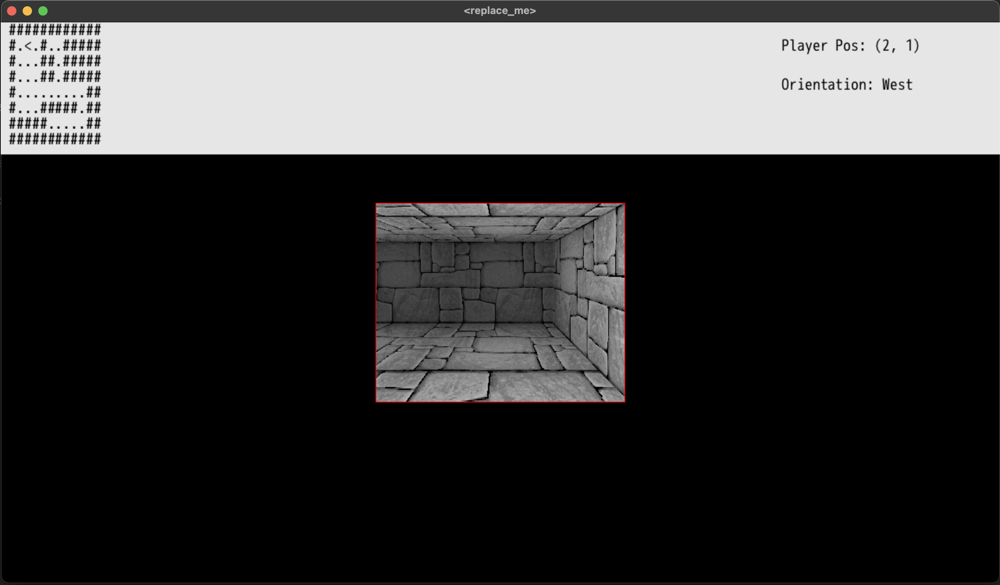

# Dragonruby Dungeon Crawler
A faux 3d renderer for dungeon crawlers made with [Dragonruby Toolkit](https://dragonruby.org/).



Controls
WASD for movement
Q/E for turning

Uses https://dungeoncrawlers.org/tools/atlas_generator/

With the following settings:
320x256
depth 3
width 3

Already included 2 variations:
- fog 
- no fog

In:
```ruby
  state.atlas ||= AtlasMapper.load_from_file("app/atlas_fog.json", { path: "sprites/untitled_fog.png", w: 528, h: 476 })
```

Can replace the atlas and png with the non-fog version

Coded in 3 days, a bunch of hardcoded stuff but it works :) 

